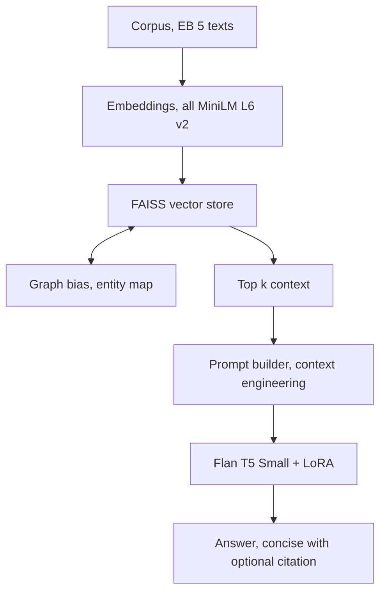
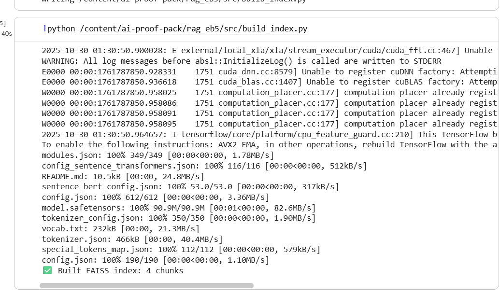
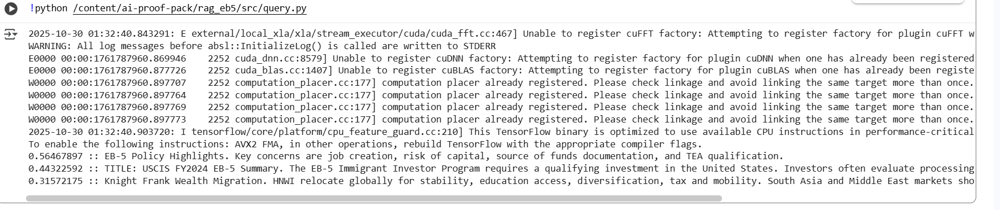
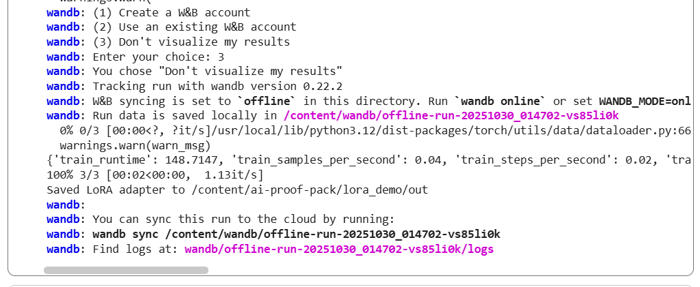
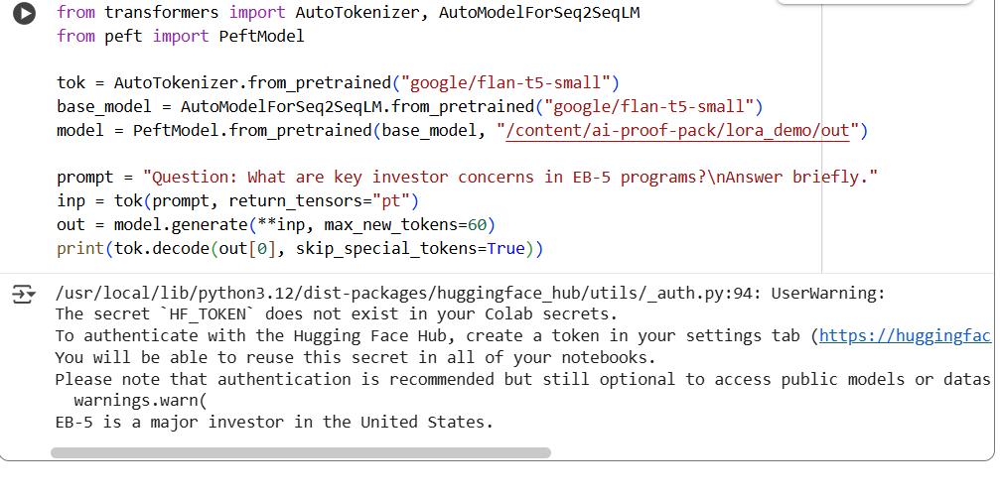

# 🌐 EB5 KnowledgeRAG  
*A clean educational demo showing Retrieval-Augmented Generation (RAG), Context Engineering, and LoRA fine-tuning in Google Colab.*

---

## 📘 Overview  
**EB5 KnowledgeRAG** is a lightweight RAG + LoRA pipeline that demonstrates how large-language-model workflows can retrieve, ground, and generate concise answers from a small, synthetic dataset inspired by residency-by-investment topics.  

This project is entirely educational and uses **paraphrased, non-commercial text** written for demonstration.  
It does **not** use or redistribute proprietary reports or confidential data.

---

## ⚙️ Features  
✅ **Semantic Retrieval (FAISS + Sentence-Transformers)** – turns text into embeddings for similarity search  
✅ **Graph Bias Expansion** – appends related entities before retrieval *(context expansion)*  
✅ **Prompt Assembly + Context Grounding** – injects retrieved text into a structured instruction template *(context grounding)*  
✅ **LoRA Fine-Tuning** – adapts `google/flan-t5-small` for short, factual Q&A answers  
✅ **End-to-End Demo** – all steps runnable in Google Colab on a free T4 GPU  

---

## 🧠 Architecture



---

## 🧩 Tech Stack  
| Component | Tool / Library |  
|------------|----------------|  
| Embeddings | `sentence-transformers/all-MiniLM-L6-v2` |  
| Vector DB | `faiss-cpu` |  
| LLM Base | `google/flan-t5-small` |  
| Fine-Tuning | `LoRA` via `peft`, `transformers`, `accelerate` |  
| Environment | Google Colab (T4 GPU) |  

---

## 🚀 Quick Start  
1. Open in **Google Colab**.  
2. Run cells in order.  
3. Verify key outputs:  
   - ✅ “Built FAISS index …”  
   - ✅ Top-k retrieval results printed  
   - ✅ “Saved LoRA adapter to …/out”  

---

## 📸 Demo Snapshots  

| Step | Screenshot | Description |
|------|-------------|--------------|
| **1️⃣ Index Build** |  | FAISS index built with 4 chunks |
| **2️⃣ RAG Query** |  | Top-k semantic matches retrieved |
| **3️⃣ LoRA Training** |  | LoRA adapter saved after fine-tuning |
| **4️⃣ Final Prompt → Answer** |  | Context-engineered prompt and LLM output |

---

## 💡 Example Query  
**Input:**  
> Why do investors pursue residency-by-investment programs?  

**Output:**  
> “Investors seek these programs for family relocation, education access, and stability while diversifying investments [1].”

---

## 🧾 Educational Intent  
- Built as a **learning artifact** to practice RAG, context engineering, and LoRA fine-tuning.  
- Demonstrates the difference between **prompt-only reasoning** and **context-grounded reasoning**.  
- Shows how **retrieval + generation** pipelines support real-time decision systems.

---

## 🧱 Folder Structure  
```
EB5_KnowledgeRAG/
│
├── rag_eb5/
│ ├── data/ (synthetic corpus + Q&A CSV + FAISS index)
│ └── src/ (build_index.py, query.py)
│
├── lora_demo/
│ └── lora_finetune.py
│
└── README.md
```


---

## 🔐 License and Third-Party Notices  
**License:** MIT  
**Libraries:**  
- `sentence-transformers`, `transformers`, `peft`, `accelerate` – Apache 2.0  
- `faiss-cpu` – BSD 3-Clause  
- `bitsandbytes` – MIT  

No affiliation, sponsorship, or endorsement is implied by any company or trademark mentioned here.  
All datasets are synthetic and safe for public release.

---

## ✍️ Author  
**Ben Clement Kishore Yadala**  
MEng CS @ Oregon State University | Data Science & LLM Practitioner  
[GitHub](https://github.com/BenYadala-BCKY) · [LinkedIn](https://www.linkedin.com/in/benyadala) 
